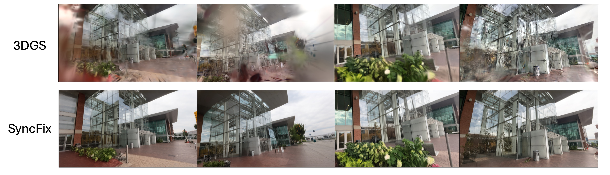
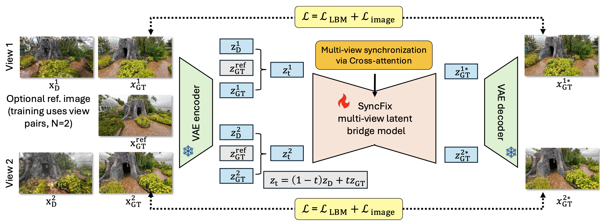

# SyncFix: Fixing 3D Reconstructions via Multi-View Synchronization

**Deming Li, Abhay Yadav, Cheng Peng, Rama Chellappa, Anand Bhattad**

[Project Page](https://syncfix.github.io/) | [Paper](https://arxiv.org/abs/2604.11797)



## Abstract
We present **SyncFix**, a framework that enforces cross-view consistency during the diffusion-based refinement of reconstructed scenes. SyncFix formulates refinement as a joint latent bridge matching problem, synchronizing distorted and clean representations across multiple views to fix the semantic and geometric inconsistencies. This means SyncFix learns a joint conditional over multiple views to enforce consistency throughout the denoising trajectory. Our training is done only on image pairs, but it generalizes naturally to an arbitrary number of views during inference. Moreover, reconstruction quality improves with additional views, with diminishing returns at higher view counts. Qualitative and quantitative results demonstrate that SyncFix consistently generates high-quality reconstructions and surpasses current state-of-the-art baselines, even in the absence of clean reference images. SyncFix achieves even higher fidelity when sparse references are available.



## Setup
```bash
conda create -n syncfix python=3.10
conda activate syncfix
pip install -e .
```

## Model Checkpoint
Download the checkpoint [here](https://drive.google.com/drive/folders/1RWGIQig_rUqH8xJXpdIjiUNOKAX1A4qE?usp=sharing).

## Inference
Run the top-level `inference.py` script to refine a degraded rendering or a directory of renderings.

```bash
python inference.py \
  --input_image path/to/input_images \
  --ref_image path/to/reference_images \
  --model_path path/to/model \
  --output_dir output \
  --n_per_pass 3 \
  --ref_size 1
```

### Main arguments
- `--input_image`: Path to an input image or a directory of degraded renderings.
- `--ref_image`: Path to a clean reference image or a directory of reference images.
- `--model_path`: Path to local model weights or a Hugging Face model directory/repository.
- `--output_dir`: Directory where refined outputs are written.
- `--height`, `--width`: Resize resolution used before inference.
- `--n_per_pass`: Number of images processed together per forward pass.
- `--ref_size`: Number of reference images appended to each forward pass.
- `--colmap_path`: Optional COLMAP path for selecting closest training views as references.

### Acknowledgements
This project is built upon [LBM](https://github.com/gojasper/LBM) and [Difix3D+](https://github.com/nv-tlabs/Difix3D). We thank all the authors for their great work and for providing the code.

## Citation
```bibtex
@article{li2026syncfix,
  title={SyncFix: Fixing 3D Reconstructions via Multi-View Synchronization},
  author={Li, Deming and Yadav, Abhay and Peng, Cheng and Chellappa, Rama and Bhattad, Anand},
  journal={arXiv preprint arXiv:2604.11797},
  year={2026}
}
```